<h3><code>suhaas@github ~ $ ./contributions.sh</code></h3>

  

<h3><code>suhaas@github ~ $ whoami</code></h3>

  

<h3><code>suhaas@github ~ $ ls ./links</code></h3>

<a href="https://www.linkedin.com/in/suhaas-surapaneni/">linkedin</a> ·
<a href="https://github.com/SuhaasS?tab=repositories">repos</a>

